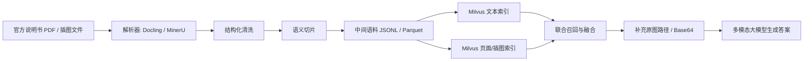

# 赛题三修订版方案：官方说明书语料解析与图文联合检索引擎

## 1. 文档定位

本文档面向本届研电赛应用赛道赛题三：

**“具有多模态能力的客服智能体设计”**

本文档只覆盖我在团队中的负责范围：

1. 官方说明书与插图语料的解析、清洗、切片、结构化整理
2. 基于 Milvus 的图文联合检索引擎改造

它不是团队总方案，而是团队总方案中的 `RAG 数据层 + 检索层子方案`。

---

## 2. 与旧版方案的关系

旧版方案中可以直接保留的部分：

1. 长说明书先解析、再清洗、再切片、再建库的主线
2. `JSONL / Parquet` 作为中间结构化语料真源
3. 文本块与页码、章节、原图之间建立稳定映射
4. 检索命中后回传图片路径，按需转 Base64
5. 图文联合检索优先于单纯文本检索

旧版方案中需要修改的部分：

1. 将 `KiCad 替代场景` 改为 `大赛官方说明书 + 官方插图`
2. 将 `V1 Qdrant / V2 Milvus` 改为 `直接以 Milvus 为主线`
3. 将“通用图文问答方案”改为“面向客服赛题的说明书知识库”
4. 增加赛题要求的 `/chat` 接口、`question + images` 输入约束
5. 增加“返回文字证据 + 对应原图路径/Base64”的链路设计

旧版方案中建议降级为拔高项的部分：

1. 图谱关系建模
2. 复杂多跳推理增强
3. 大规模微调

结论：

**旧版方案主线可以复用，但必须从“通用演示方案”收敛为“正式赛题驱动、当前仓库可落地、突出我负责模块”的执行稿。**

---

## 3. 赛题约束与目标重述

根据赛题要求，本项目至少需要满足以下约束：

1. 基于举办方提供的 `20 万字以上说明书及相关插图文件` 构建知识库
2. 面向 `400 道 AB 榜客服问题` 输出答案
3. 能针对用户问题精准返回说明书中的对应内容和相关配图
4. `/chat` 接口需要支持 `question` 和可选 `images(Base64)` 输入
5. 最终回答质量由 LLM 裁判综合评分，图片必须真实提升理解效果

因此，我负责模块的核心目标不是“把文档塞进向量库”，而是：

1. 把说明书整理成程序易读、可追溯、可复建的结构化语料
2. 让检索层稳定回传 `文字证据 + 原图证据`
3. 为上层多模态大模型提供高质量、低噪声、可解释的上下文

---

## 4. 我的负责范围

### 4.1 模块一：语料解析

目标：

将官方说明书、附带插图、页图、图注等材料，整理成适合程序处理和检索的数据格式。

核心任务：

1. 解析 PDF / 说明书原始文件
2. 抽取正文、页码、章节、图注、插图、表格说明
3. 清洗页眉页脚、重复标题、异常换行、乱码和噪声
4. 进行语义切片，生成结构化 chunk
5. 建立 chunk 与 page / figure / image_path 的映射关系

### 4.2 模块二：图文联合检索引擎

目标：

改造当前 Milvus 检索链路，使其不仅能检索文本，还能在检索命中时把对应说明书原图路径或 Base64 一起组织出来传给大模型。

核心任务：

1. 设计适合当前项目的 Milvus schema
2. 支持文本块与页面图、局部图的索引
3. 支持查询后同时返回文本证据和图像证据
4. 应用层按需把命中图片转 Base64
5. 向上游模型层输出统一的多模态上下文对象

### 4.3 不直接负责但需要协同的部分

1. 多轮对话记忆
2. 幻觉抑制 prompt
3. 最终答案生成策略
4. 前端展示与整体验证 API

---

## 5. 当前仓库基础与差距

当前仓库已经具备以下基础：

1. FastAPI 服务框架
2. RAG 基础链路
3. Milvus 向量库存储
4. 文本文件上传与索引能力
5. LangChain / LangGraph agent 基础设施

但距离赛题要求还有明显差距：

1. 当前上传接口仅支持 `.txt` 和 `.md`，不支持说明书 PDF 解析
2. 当前切片只处理纯文本，不处理页码、插图、图注、bbox
3. 当前 Milvus schema 只有单一文本向量字段
4. 当前知识检索只返回文本上下文，不返回图片路径或 Base64
5. 当前 `/chat` 请求模型还没有 `images` 字段

后续主要改造点为：

1. `app/api/file.py`
2. `app/services/document_splitter_service.py`
3. `app/services/vector_index_service.py`
4. `app/services/vector_store_manager.py`
5. `app/tools/knowledge_tool.py`
6. `app/models/request.py`

---

## 6. 总体技术路线



总体原则：

1. 解析层和检索层解耦
2. 中间语料是唯一真源
3. 向量库优先存路径，不长期存 Base64
4. 检索结果必须可追溯回原页和原图

---

## 7. 数据层设计

### 7.1 中间语料目标

中间语料必须同时满足：

1. 可重复建库
2. 可单独调试清洗质量
3. 可支持文本检索与图片检索
4. 可支持后续答辩展示

### 7.2 推荐中间数据格式

建议统一采用 `JSONL`，每条记录以 `chunk` 为主键，同时保留所在页和配图引用：

```json
{
  "doc_id": "manual_01",
  "page_id": "manual_01_p0123",
  "chunk_id": "manual_01_p0123_c04",
  "page_no": 123,
  "section_path": ["安装说明", "电池维护", "充电指示灯"],
  "text": "清洗后的正文内容",
  "chunk_type": "paragraph",
  "source_pdf": "raw/manual_01.pdf",
  "page_image_path": "assets/pages/manual_01/p0123.png",
  "figure_refs": [
    {
      "image_id": "manual_01_p0123_f02",
      "path": "assets/figures/manual_01/p0123_f02.png",
      "caption": "充电指示灯含义示意图",
      "bbox": [100, 120, 450, 380]
    }
  ],
  "language": "zh",
  "has_figure": true
}
```

### 7.3 补充图片索引记录

除 chunk 主记录外，还需要生成单独的图片记录，用于图片侧检索：

```json
{
  "image_id": "manual_01_p0123_f02",
  "page_id": "manual_01_p0123",
  "doc_id": "manual_01",
  "page_no": 123,
  "image_path": "assets/figures/manual_01/p0123_f02.png",
  "image_type": "figure",
  "caption": "充电指示灯含义示意图",
  "section_path": ["安装说明", "电池维护", "充电指示灯"],
  "related_chunk_ids": ["manual_01_p0123_c03", "manual_01_p0123_c04"]
}
```

### 7.4 为什么不直接存 Base64

不建议在中间语料和 Milvus 中直接长期存完整 Base64，原因如下：

1. 存储开销大
2. 重建索引成本高
3. Base64 不利于排查和人工抽检
4. 赛题接口要求的是输入图片 Base64，不代表底层知识库必须长期存 Base64

正确做法：

1. Milvus 中存 `image_path / image_id / page_id`
2. 检索命中后由应用层按需读图
3. 调模型前临时转 Base64

---

## 8. 说明书解析方案

### 8.1 解析器选择

候选解析器：

1. `Docling`
2. `MinerU`

#### 8.1.1 不再悬空的决策

为避免“解析器一直未定，后续全部阻塞”，本方案直接采用以下工程决策：

1. **默认主路线：`Docling`**
2. **默认备路线：`MinerU`**
3. **决策窗口：48 小时内完成小样本基准测试，不再继续拖延**

当前先定 `Docling` 为主路线的原因：

1. 更贴近当前 Python 工程体系，便于直接接入结构化 JSON / Markdown 后处理链
2. 对“数字原生 PDF + 章节结构 + 段落输出”的场景更容易快速落地
3. 本项目当前最大阻塞不是 OCR 极限能力，而是先把完整解析-清洗-切片链路跑通

保留 `MinerU` 的原因：

1. 对扫描件、复杂版式、OCR 场景通常更有补位价值
2. 若官方说明书存在较多“图文混排 + 解析错序 + 表格错位”页面，可作为备选兜底

#### 8.1.2 选型门槛

使用官方语料中的 `30 页基准样本` 做对比，覆盖：

1. 纯文字页
2. 图文混排页
3. 多图页
4. 表格页
5. 操作步骤页

评分维度与权重如下：

1. 标题层级保留率：`30%`
2. 正文阅读顺序正确率：`25%`
3. 图注与图片配对正确率：`25%`
4. 表格与列表结构保留率：`10%`
5. 解析速度与稳定性：`10%`

最终决策规则：

1. 若 `Docling` 综合分数 `>= 85`，直接定为正式主方案
2. 若 `MinerU` 综合分数高于 `Docling` 超过 `8` 分，切换主方案
3. 若 `Docling` 的图注-图片配对正确率低于 `MinerU` 超过 `10%`，即使总分略高，也切换到 `MinerU`
4. 若两者差异不大，维持 `Docling 主 / MinerU 备`

#### 8.1.3 退出条件

如果出现以下任一情况，则立即停止继续争论，直接切换到备路线：

1. 连续两轮抽样中，主解析器出现大面积页序错乱
2. 图注抽取失败率超过 `20%`
3. 关键图片无法稳定落盘或无法关联回原页

### 8.2 清洗规则

说明书清洗需要重点处理以下问题：

1. 页眉页脚
2. 重复导航标题
3. 页码噪声
4. 连字符断行
5. OCR 错位导致的换行异常
6. 图注与正文混杂
7. 表格说明跨页断裂

#### 8.2.1 清洗总流程伪代码

```python
for page in pages:
    blocks = parse_layout_blocks(page)
    blocks = remove_header_footer_noise(blocks, global_page_stats)
    blocks = remove_page_number_noise(blocks)
    blocks = normalize_whitespace(blocks)
    blocks = repair_hyphen_breaks(blocks)
    blocks = merge_ocr_wrapped_lines(blocks)
    blocks = split_caption_and_body(blocks)
    blocks = mark_block_types(blocks)
    save_clean_blocks(page.id, blocks)
```

#### 8.2.2 页眉页脚识别规则

核心思想：

**不是看单页内容，而是看“跨页重复 + 固定位置”两个条件同时满足。**

规则：

1. 对每页顶部 `10%` 区域、底部 `10%` 区域的文本行分别取样
2. 对文本做归一化：
   - 去首尾空白
   - 连续空格压缩
   - 删除纯页码数字
   - 英文转小写
3. 统计同一归一化文本在全书中出现的页数占比
4. 若某文本同时满足：
   - 出现页占比 `>= 60%`
   - 且总是在顶部或底部同一高度带内
   - 且文本长度较短或明显属于导航语
   则判定为页眉/页脚噪声

伪代码：

```python
def is_header_footer(line, page_height, repeated_ratio, y_center):
    in_top_band = y_center <= page_height * 0.10
    in_bottom_band = y_center >= page_height * 0.90
    stable_zone = in_top_band or in_bottom_band
    return repeated_ratio >= 0.60 and stable_zone
```

#### 8.2.3 页码噪声识别规则

优先使用正则：

1. `^\d+$`
2. `^第?\s*\d+\s*页$`
3. `^\d+\s*/\s*\d+$`
4. `^page\s+\d+$`

同时要求：

1. 位于顶部或底部边缘区
2. 独占一行
3. 文本极短

#### 8.2.4 连字符断行修复规则

只对英文或数字字母混排内容启用该规则，中文正文不启用。

规则：

1. 当前行以 `-` 结尾
2. 下一行以小写字母、数字或括号开头
3. 当前行不是标题、列表项、表格行

满足时：

1. 删除当前行末尾 `-`
2. 与下一行直接拼接，不加空格

伪代码：

```python
def should_merge_hyphen(line_a, line_b):
    return (
        line_a.rstrip().endswith("-")
        and re.match(r"^[a-z0-9(]", line_b.strip())
        and not is_heading(line_a)
        and not is_list_item(line_a)
        and not is_table_row(line_a)
    )
```

#### 8.2.5 OCR 异常换行合并规则

规则：

如果当前行与下一行满足以下条件，则视为同一段：

1. 当前行末尾不是句号、问号、感叹号、冒号
2. 下一行不是标题、列表项、图注、表格行
3. 两行在版面上纵向距离很小
4. 当前行长度明显短于正常段落，或下一行明显是续行

伪代码：

```python
def should_merge_wrapped_lines(line_a, line_b, y_gap):
    return (
        not ends_with_sentence_punct(line_a)
        and not is_heading(line_b)
        and not is_list_item(line_b)
        and not is_caption(line_b)
        and not is_table_row(line_b)
        and y_gap <= MERGE_LINE_GAP
    )
```

#### 8.2.6 图注分离规则

图注识别优先级：

1. 正则命中：`图 1` / `Figure 1` / `Fig.1` / `表 1`
2. 位于图片正下方或正上方
3. 文本较短
4. 字号与正文略有差异

识别后将图注标记为单独 block，避免与正文混在一个 chunk 里。

### 8.3 切片规则

切片不建议只按固定字数硬切，而采用：

1. `标题层级优先`
2. `段落语义优先`
3. `图注与正文关联优先`
4. `必要时保留相邻上下文`

建议切片粒度：

1. 普通段落：`300-800` 中文字符量级
2. 操作步骤：按步骤项切分
3. 图注说明：尽量独立成块
4. 表格说明：保留完整语义单元

### 8.4 图文映射规则

必须建立以下映射：

1. `chunk -> page_id`
2. `chunk -> page_image_path`
3. `chunk -> figure_refs`
4. `image_id -> related_chunk_ids`
5. `page_id -> all_chunk_ids`

#### 8.4.1 图文映射总算法

图文映射采用 `page-first + spatial-link + caption-propagation + reference-boost` 四步法。

步骤如下：

1. `page-first`
   - 所有 block、图片、图注先统一挂到 `page_id`
   - 保证任意对象至少能回到原页
2. `spatial-link`
   - 用 bbox 在页面坐标系中寻找图片与最近图注
3. `caption-propagation`
   - 图注找到后，把图注上下文对应的正文块也纳入候选
4. `reference-boost`
   - 若正文显式提到“如图”“见下图”“Figure 3”等，对应图片关联分数提升

#### 8.4.2 页面坐标统一

解析阶段要求所有 block 和图片都带有统一坐标：

1. `x0, y0, x1, y1`
2. 统一归一化到 `[0, 1]`
3. 保留 `reading_order`

没有统一坐标，就没法稳定做图文映射。

#### 8.4.3 图片与图注配对算法

对每一张图片 `fig`，在同页内寻找候选图注 `cap`。

候选条件：

1. `cap` 是 caption 类型 block，或命中图注正则
2. `cap` 与 `fig` 在垂直方向距离小于阈值
3. `cap` 与 `fig` 有一定水平重叠

匹配分数建议：

```text
score(fig, cap) =
    0.45 * vertical_distance_score +
    0.35 * horizontal_overlap_score +
    0.20 * caption_regex_score
```

只保留每张图最高分图注，且要求总分 `>= 0.55`。

#### 8.4.4 图片与正文 chunk 关联算法

对每张图 `fig`，先找到其图注 `cap`，再为其找相关正文 chunk。

关联候选来源：

1. 图注前后 `±3` 个阅读顺序 block
2. 同页且同 section_path 的正文块
3. 文本中显式出现图号、图注关键词、按钮名、部件名的 chunk

chunk 关联分数建议：

```text
score(chunk, fig) =
    0.45 * explicit_reference_score +
    0.25 * reading_order_neighbor_score +
    0.20 * same_section_score +
    0.10 * keyword_overlap_score
```

保留规则：

1. 每个 chunk 最多挂 `top 3` 张图
2. 每张图至少保留 `top 2-5` 个相关 chunk
3. 若无高分命中，仍保留 `page_image_path` 作为兜底视觉证据

#### 8.4.5 图文映射伪代码

```python
for page in pages:
    figures = detect_figures(page)
    captions = detect_captions(page.blocks)
    chunks = build_chunks(page.blocks)

    for fig in figures:
        best_caption = argmax(captions, key=lambda cap: caption_score(fig, cap))
        fig.caption = best_caption

        candidate_chunks = collect_neighbor_chunks(best_caption, chunks, window=3)
        candidate_chunks += same_section_chunks(best_caption, chunks)
        candidate_chunks += explicit_ref_chunks(fig, chunks)

        scored = [(chunk, chunk_figure_score(chunk, fig)) for chunk in dedup(candidate_chunks)]
        linked_chunks = topk([x for x in scored if x.score >= 0.35], k=5)

        fig.related_chunk_ids = [chunk.id for chunk in linked_chunks]

        for chunk in linked_chunks:
            chunk.figure_refs.append(fig.meta())
```

#### 8.4.6 首版简化策略

为了尽快落地，第一版采用以下分层交付原则：

1. **先保证 `chunk -> page` 100% 可追溯**
2. **再保证 `有图页面 -> page_image_path` 100% 可回传**
3. **最后再做 `chunk -> figure_refs` 的精细映射**

---

## 9. Milvus 检索引擎改造方案

### 9.1 总体策略

考虑当前仓库基础，推荐采用以下工程路线：

#### 第一版：双 collection，但底层统一使用 Milvus

1. `text_chunks`
2. `page_figures`

优点：

1. 与当前单向量代码更兼容
2. 开发风险低
3. 调试容易
4. 足够支撑比赛初赛

#### 第二版：视时间升级为单库多向量

如时间允许，再考虑将文本向量与图片向量整合为单库多字段 schema。

结论：

**当前最稳妥方案不是一开始就强上复杂多向量单库，而是先在 Milvus 上实现文本库 + 图片库的联合检索。**

### 9.2 推荐 collection 设计

#### text_chunks collection

字段建议：

1. `id`
2. `doc_id`
3. `page_id`
4. `chunk_id`
5. `page_no`
6. `content`
7. `section_path`
8. `page_image_path`
9. `figure_refs`
10. `text_vector`

#### page_figures collection

字段建议：

1. `id`
2. `image_id`
3. `doc_id`
4. `page_id`
5. `page_no`
6. `image_path`
7. `caption`
8. `section_path`
9. `related_chunk_ids`
10. `image_vector`

### 9.3 图片向量生成方案

图片向量不能继续留空，首版直接按以下方案落地：

#### 方案 A：首版基线

使用**可本地部署的跨模态图文 embedding 模型**生成图片向量，优先选择：

1. `SigLIP`
2. 或同类 text-image dual encoder

首版推荐原因：

1. 查询文本可以映射到图片向量空间
2. 不依赖上层生成模型本体
3. 便于离线批量建库

#### 方案 B：后续替换

如果后续团队统一改成某家稳定的云侧多模态 embedding 服务，可只替换向量生成模块，不改中间语料与回传逻辑。

#### 具体生成对象

至少生成两类图片向量：

1. `page_image_vector`：整页截图向量
2. `figure_image_vector`：局部插图裁剪向量

其中：

1. 整页截图更适合定位“这个界面在哪一页”
2. 局部插图更适合定位“这个闪烁图标/按钮/结构图是什么意思”

#### 图片预处理规则

1. 页面图：
   - PDF 渲染为 `150-200 DPI`
   - 长边控制在模型建议尺寸附近
2. 局部图：
   - 按 bbox 裁剪
   - 四周补 `8-16 px` 边距
   - 首版建议保留少量下边距，避免把图注完全裁掉

#### 查询侧如何搜图片

当用户输入文本问题时：

1. 用同一个跨模态 embedding 模型对问题文本编码
2. 在 `page_figures` collection 中做向量检索
3. 返回最相近的页面图或局部图

也就是说，图片向量不是“只给图片用”，而是要让**文本查询也能进入图片空间**。

#### 图片向量生成伪代码

```python
for page in pages:
    page_img = render_page(page.pdf, dpi=180)
    page_vec = image_encoder.encode_image(page_img)
    save_page_vector(page.page_id, page_vec)

    for fig in page.figures:
        crop = crop_with_padding(page_img, fig.bbox, pad=12)
        fig_vec = image_encoder.encode_image(crop)
        save_figure_vector(fig.image_id, fig_vec)
```

### 9.4 检索查询流程

#### 文本问题输入时

1. 用户输入问题
2. 生成文本查询向量
3. 在 `text_chunks` 中召回 `top 20` 文本块
4. 若问题明显涉及位置、图示、按钮、外观、闪烁标识等，再走图片分支
5. 在 `page_figures` 中召回 `top 12` 图片/页图
6. 两路统一折叠到 `page_id`
7. 用加权 RRF 融合
8. 回填最优 chunk 与对应 image_path
9. 按需转 Base64
10. 打包给多模态大模型

#### 用户同时上传图片时

1. 上游多模态理解模块先识别用户图片意图
2. 产出增强后的文本查询
3. 仍由本模块负责知识库检索和证据回填

### 9.5 召回层与提示层必须分开限流

为了兼顾效果与稳定性，必须区分：

1. **召回候选层**：可以宽一点
2. **最终喂给大模型的上下文层**：必须严格限制

首版建议：

1. 文本原始召回：`top 20`
2. 图片原始召回：`top 12`
3. 融合后页面：`top 6`
4. 最终进入大模型的页面：`top 3`

### 9.6 结果融合策略

推荐初版策略：

1. 文本分支召回 `chunk`
2. 图片分支召回 `page / figure`
3. 两路统一折叠到 `page_id`
4. 用加权 RRF 融合
5. 再回填页面下最优 chunk 和图片

推荐初始参数：

1. `w_text = 0.65`
2. `w_image = 0.35`
3. `k = 60`

---

## 10. 返回给大模型的上下文格式与预算

### 10.1 返回给大模型的上下文格式

```json
{
  "query": "我的充电器指示灯闪烁时分别代表什么含义？",
  "text_hits": [
    {
      "chunk_id": "manual_01_p0123_c04",
      "page_id": "manual_01_p0123",
      "text": "DCB107、DCB112 电池组充电中...",
      "section_path": ["电池维护", "充电指示灯"]
    }
  ],
  "image_hits": [
    {
      "image_id": "manual_01_p0123_f02",
      "page_id": "manual_01_p0123",
      "image_path": "assets/figures/manual_01/p0123_f02.png",
      "caption": "充电指示灯含义示意图",
      "image_base64": null
    }
  ]
}
```

### 10.2 首版上下文预算必须现在就定

这个问题不能留到后面再说，原因是：

1. 赛题接口对时延有要求
2. Base64 图片体积很大
3. 不做限制会导致线上调用不稳定、超时和成本失控

因此首版就要有硬预算。

### 10.3 首版预算建议

#### 文本证据预算

1. `text_hits <= 4`
2. 总正文证据长度控制在 `2500-3500` 中文字符以内
3. 单 chunk 超长时只截取最相关片段，不整段硬塞

#### 图片证据预算

1. `base64_images <= 2`
2. 优先级为：
   - 第 1 张：最相关局部图或页面图
   - 第 2 张：补充图或整页上下文图
3. 若用户请求里本身带图，则知识库侧最多再补 `1-2` 张

#### Token 预算

首版建议把“检索证据 + 系统提示 + 用户问题”总输入控制在：

1. 常规模式：`<= 6000 input tokens`
2. 宽松模式：`<= 8000 input tokens`

如果模型窗口更大，也不要首版就无限放开，因为评测目标不是“喂最多”，而是“喂最有效”。

### 10.4 证据裁剪顺序

当证据超预算时，按如下顺序裁剪：

1. 先删低分图片
2. 再删低分 chunk
3. 再截短 chunk 内容
4. 最后才减少融合后的 top pages

### 10.5 上下文组装伪代码

```python
text_hits = top_text_hits[:4]
image_hits = top_image_hits[:2]

text_hits = trim_text_hits(text_hits, max_chars=3200)
image_hits = trim_images(image_hits, max_images=2)

payload = build_multimodal_context(
    query=query,
    text_hits=text_hits,
    image_hits=image_hits,
    token_budget=6000,
)
```

---

## 11. 与当前仓库的具体改造落点

### 11.1 `app/api/file.py`

修改方向：

1. 新增说明书导入接口，支持 `pdf`
2. 支持目录级导入或批量导入
3. 将“上传”与“解析建库”解耦

### 11.2 `app/services/document_splitter_service.py`

修改方向：

1. 从单纯文本切片升级为“结构化语义切片”
2. 支持按 `section_path / page_id / figure_refs` 输出

### 11.3 `app/services/vector_index_service.py`

修改方向：

1. 支持读取中间语料
2. 同时构建文本索引和图片索引
3. 支持以 `page_id` 为桥接键

### 11.4 `app/services/vector_store_manager.py`

修改方向：

1. 拆分或扩展为文本 collection 与图片 collection
2. 支持更多元数据字段输出

### 11.5 `app/tools/knowledge_tool.py`

修改方向：

1. 返回文本证据
2. 返回图片路径
3. 需要时返回 Base64
4. 给上游模型层提供“图文组合证据”

### 11.6 `app/models/request.py`

修改方向：

1. 对齐赛题 `/chat` 格式
2. 支持 `question`
3. 支持 `images`
4. 支持 `session_id`
5. 支持 `stream`

---

## 12. 分阶段执行计划

### 阶段 A：说明书解析与中间语料落地

目标：

完成官方说明书从原始文件到结构化 `JSONL` 的转换。

产出：

1. 解析脚本
2. 清洗脚本
3. 切片脚本
4. 页面图与局部图目录
5. 中间语料样例

验收标准：

1. 任意 chunk 可追溯到页码
2. 有图页面可追溯到图路径
3. 抽样检查语义切片基本合理

### 阶段 B：Milvus 图文联合建库

目标：

将中间语料导入 Milvus，形成文本侧和图片侧索引。

产出：

1. 文本 collection
2. 图片 collection
3. 建库脚本
4. 索引重建脚本

验收标准：

1. 文本可召回 chunk
2. 图片可召回 page / figure
3. 结果可通过 `page_id` 对齐

### 阶段 C：联合检索与证据回填

目标：

实现“问题进来，文字和图一起回来”的检索链路。

产出：

1. 联合检索服务
2. 融合策略实现
3. Base64 按需生成模块
4. 给大模型使用的上下文打包格式

验收标准：

1. 对图示类问题，能带回对应图
2. 对步骤类问题，能带回正确文字块
3. 图文结果能在同一次调用中组织出来

### 阶段 D：评测与答辩材料支撑

目标：

为团队整体方案提供可量化证据和可展示样例。

产出：

1. 解析质量抽检报告
2. 检索准确率报告
3. 图文联合召回案例
4. 失败样例分析

---

## 13. 评测指标建议

### 13.1 解析层指标

1. 标题层级保留率
2. 页码映射正确率
3. chunk 到 page 的追溯成功率
4. chunk 到 image 的追溯成功率

### 13.2 检索层指标

1. Top-K 文本召回率
2. Top-K 页面召回率
3. Top-K 插图召回率
4. 图文同时命中率

### 13.3 端到端支撑指标

1. 检索结果中是否含正确图片
2. 图片是否对最终回答有帮助
3. 多模态答案是否明显优于纯文本答案

---

## 14. 风险与应对

### 风险一：官方说明书解析质量不稳定

应对：

1. 保留双解析路线
2. 关键页面人工抽检
3. 允许针对特殊章节定制清洗规则

### 风险二：切片后图文关系断裂

应对：

1. 切片时优先保留 `page_id`
2. 图注独立入库
3. chunk 显式引用 `figure_refs`

### 风险三：Base64 传输过重

应对：

1. 默认只返回路径
2. 只对 top 命中图片做 Base64
3. 控制单次传图数量

### 风险四：Milvus 多向量改造过重，影响进度

应对：

1. 首版优先双 collection
2. 后续再考虑多向量单库
3. 不让底层 schema 复杂度拖慢赛题主线

---

## 15. 我的模块最终交付物

我负责模块最终应至少形成以下成果：

1. 一套官方说明书解析与清洗流程
2. 一份统一中间语料格式规范
3. 一套文本与图片可追溯映射关系
4. 一套基于 Milvus 的图文联合检索原型
5. 一条“命中文本 + 回传原图路径/Base64”的完整链路
6. 一份检索与解析效果验证报告

---

## 16. 面向答辩的表达方式

我负责部分可以概括为一句话：

**“我负责把官方说明书整理成可检索、可追溯、可多模态调用的结构化知识底座，并让检索结果不只返回文字，还能把对应原图一起带给大模型。”**

更短的版本可以说：

**“我做的是两件事：先把说明书整理干净，再把文字和图片一起找准。”**

---

## 17. 结论

本修订版方案相较旧版的核心变化在于：

1. 从替代场景转为正式赛题
2. 从通用图文问答转为客服智能体知识库支撑
3. 从概念型技术路线转为可直接落到当前仓库的工程方案

对我负责的模块来说，最重要的不是一次性把所有高级能力都做满，而是优先确保三件事：

1. 说明书能被稳定解析和切片
2. chunk 与原图之间的映射真实可靠
3. 检索时能把 `文字 + 原图路径/Base64` 一起交给模型

只要这三件事做好，团队在上层多模态问答、对话管理和幻觉抑制上的效果会显著更稳。
